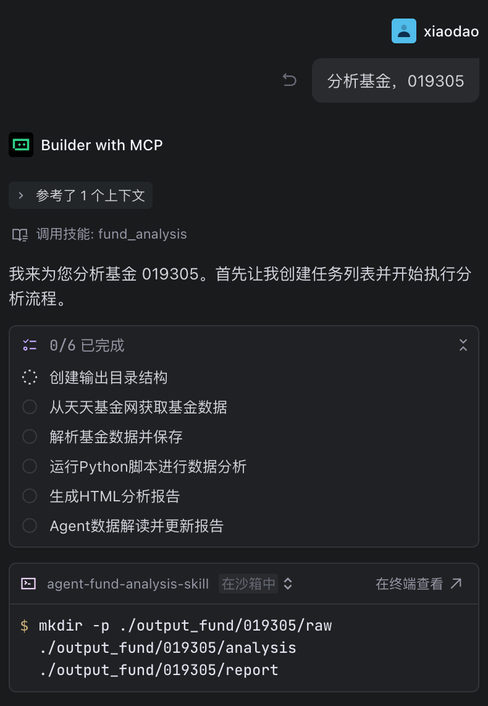

# 基金分析 Skill

<p align="center">
  
  
  
  
</p>

> "买基金前先看报告 —— 让数据说话，让投资更理性"

<p align="center">
  <b>输入基金代码 → 自动计算指标 → 生成专业分析报告 → 获取数据洞察</b>
</p>

---

## 这是什么

一个运行在 Trae / Claude Code / Cursor 等 Agent 环境中的 Skill，帮你快速分析基金投资数据。

只需说出基金代码，Agent 会自动：
1. 从天天基金网抓取历史净值数据
2. 使用脚本进行多维度指标计算（净值走势、压力指标、周期收益、反转周期等），避免幻觉
3. 生成精美的 PPT 风格 HTML 报告
4. 提供 Agent 数据洞察和投资建议

---

## 功能亮点

| 功能 | 说明 |
|------|------|
| 📈 **净值走势可视化** | 交互式累计净值曲线，支持缩放和悬停查看 |
| 📊 **多周期统计分析** | 1月/半年/1年/3年/成立以来的净值分布统计 |
| 🎯 **压力指标分析** | 识别支撑位和压力位，标注当前净值位置 |
| 📉 **周期涨跌幅分析** | 1天/3天/1周/1月/半年/1年不同持有周期的收益表现 |
| 🔄 **收益反转周期** | 统计正转负、负转正的反转天数，辅助择时决策 |
| 📅 **月度收益分析** | 月度收益分布统计和可视化 |
| 🤖 **Agent 数据洞察** | 自动生成专业的数据解读和投资建议 |
| 📄 **PDF 一键导出** | 支持导出为 PDF，方便分享和存档 |

---


---

## 使用示例

### 1. 触发基金分析

在 Trae Agent 中，只需说出基金代码即可触发分析：

```
分析基金，019305
```

或

```
帮我分析一下基金 000001
```

Agent 会自动识别意图并调用 fund_analysis skill。

### 2. 分析流程

触发后，Agent 会执行以下 6 个步骤：

| 步骤 | 任务 |
|------|------|
| 1️⃣ | 创建输出目录结构 |
| 2️⃣ | 从天天基金网获取基金数据 |
| 3️⃣ | 解析基金数据并保存 |
| 4️⃣ | 运行 Python 脚本进行数据分析 |
| 5️⃣ | 生成 HTML 分析报告 |
| 6️⃣ | Agent 数据解读并更新报告 |

### 3. 查看报告

分析完成后，会生成以下文件：

```
output_fund/
└── {基金代码}/
    ├── raw/                    # 原始数据
    │   └── net_value.csv       # 净值数据
    ├── analysis/               # 分析结果
    │   └── analysis_results.json
    └── report/                 # 报告文件
        └── fund_analysis_report.html  # HTML 分析报告
```

打开 `fund_analysis_report.html` 即可查看完整的分析报告，支持导出为 PDF。

### 4. 示例截图

**用户查询示例：**



**生成的报告示例：** 见 [README_ASSETS/report_example.pdf](README_ASSETS/report_example.pdf)

---

## 开发迭代

### Python 环境

```bash
# 安装 uv，方法一
curl -Ls https://astral.sh/uv/install.sh | bash
uv --version

# 创建虚拟环境
uv venv         
# 激活虚拟环境
source .venv/bin/activate  
# 安装依赖
uv pip install -r requirements.txt

# 运行脚本
python xxx.py

# uv 依赖跟 requirements.txt 保持一致
uv pip list --format=freeze > requirements.txt
```

### Skill 测试迭代

- 更新 skills 到目标 agent 目录
```bash
rsync -av --delete fund_analysis/ .trae/skills/fund_analysis/
```

---

## License

MIT
